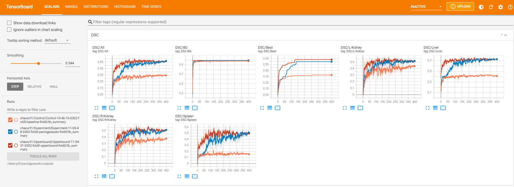

This repo contains source code for the scribble-supervised learning paper: **Non-iterative Scribble-Supervised Learning for Medical Image Segmentation.** October, 2022. [[arXiv]](https://arxiv.org/pdf/2210.10956.pdf)

### Datasets

| Dataset                                                      | Image Modality          | Target Antomy                               | Scribble                                                     | #Images |
| ------------------------------------------------------------ | ----------------------- | ------------------------------------------- | ------------------------------------------------------------ | ------- |
| **CHAOS** [[challenge website]](https://chaos.grand-challenge.org/) | MRI T1-DUAL and T2-SPIR | Liver, Left-kidney, Right-kidney, Spleen    | Manual [[download link]](https://drive.google.com/file/d/1LFfso17fxPaCcwcQJ4lzyKKG22EKGnlt/view?usp=share_link) | 1,917   |
| **ACDC** [[challenge website]](https://www.creatis.insa-lyon.fr/Challenge/acdc/databases.html) | Cine-MRI                | Right ventricle, Myocardium, Left ventricle | Manual [[download link]](https://vios-s.github.io/multiscale-adversarial-attention-gates/data) | 1,902   |
| **LVSC** [[challenge website]](https://www.cardiacatlas.org/challenges/lv-segmentation-challenge/) | MRI '2D+time'           | Myocardium                                  | Artificial                                                   | 29,086  |

### Data Preparation

Take CHAOS T1 as an example. The following steps transform raw data for training.

1. Resample pixel sizes to 1.62$\times$1.62mm$^2$, and then crop or pad the axial view to 256$\times$256pixels.
2. Save the 3D volumes slice by slice in .npz format. Each contains an image, label and scribble.
3. Split slices into five folds at patient level and store split information in text files.

Specifically, 2D images and five-fold validation text files are stored in **./data/chaos/train_test_split/data_2d** and **./data/chaos/train_test_split/five_fold_split** respectively. 

Dataloaders for loading  and augmenting images for network learning is stored in **./datasets/chaos/chaos_dataset.py**.

We upload **./data/chaos/train_test_split** in Google Drive [[here]](https://drive.google.com/file/d/1X5TadvQeRzRvP_-1gFz-Tm_LhVtjWoOe/view?usp=share_link). Download and unzip the data into your working directory for reproduction.

### Model

We train three models for comparison. They are the baseline model, our pacingpseudo model, and the fully-supervised model. The baseline is the UNet backbone penalized by the partial cross entropy loss. Our pacingpseudo uses the siamese architecture to implement the consistency training. Details are described in the paper [[arXiv]](https://arxiv.org/pdf/2210.10956.pdf). The fullly-supervised model is the UNet trained with the cross-entropy loss and Dice loss.

### Environment

First, create and activate a virtual environment named `pacingpseudo` with `python 3.6`.

```
conda create -n pacingpseudo python=3.6
```

Then, install necessary packages as follows.

````
torch=1.7.1
tensorboard=2.7.0
numpy=1.19.5
matplotlib=3.3.4
medpy=0.4.0
simpleitk=2.1.1
````

### Training

**train_chaos.py** contains program for training the baseline model and pacingpseudo model. **upperbound_chaos.py** is for training the fully-supervised model. At the end of each training epoch, we compute Dice similarity coefficients on the validation dataset and plot them using TensorBoard.

To run the training programs, we have to input configuration parameters. Below is the command line for learning the baseline model on CHAOS T1.

```
python train_chaos.py --gpu=0 --session=Control --tag=baseline-fold0 --fold=0 --modality=t1
```

The pacingpseduo model needs additional configurations. Its training command line is as follows.

```
python train_chaos.py --gpu=0 --session=Experiment --tag=pacingpseudo-fold0 --fold=0 --modality=t1 --do_loss_ent --do_decoder_consistency --do_aux_path --do_memory
```

The upperbound model uses **upperbound_chaos.py** to train. Below is the command line to run **upperbound_chaos.py**.

```
python upperbound_chaos.py --gpu=0 --session=Upperbound --tag=upperbound-fold0 --fold=0 --modality=t1
```


Training outputs are stored in **./outputs**. They include logging files, model checkpoints, and tensorboard files.

Tensorboard files monitor loss values, validation results, intermediate predictions during training. The following command calls the tensorboard interface.

```
tensorboard --logdir=./outputs --port=6007 --bind_all
```

Then, on your browser, type `localhost:6007` to watch the interface.

<center><b>Validation Results on CHAOS T1</b></center>




### Inference

**Inference.py** is designed to compute evaluation metrics given a model parameter checkpoint. We use the final checkpoint in our experiments. The metrics includes the Dice similarity coefficients (DSC) and the 95-*th* percentile of Hausdorff distance (HD95). Roughly speaking, DSC quantifies relative overlap and HD95 quantifies boundary distance. Here is a lecture on [Hausdorff distance between convex polygons](http://cgm.cs.mcgill.ca/~godfried/teaching/cg-projects/98/normand/main.html).

The following command uses the pacingpseduo model to inference validation metrics. We load model parameters at the final checkpoint by default.

```
python inference.py --gpu=0 --dataset=chaost1 --fold=0 --checkpoint_file=./outputs/chaos/t1/Experiment/Experiment-11-05-48-0302-fold0-pacingpseudo-fold0
```

Inference outputs are stored in **./outputs/inference**.

### Results

We summarize results in DSC and HD95. HD95 is measured in millimeters (mm). Higher is better for DSC and lower is better for HD95.

Below are the results of five-fold validation. Specifically,  in each fold, we first compute the average score of each anatomy over patients, which results in $K$ values. $K$ is the number of anatomies. Then we compute the average of these $K$ values. Since there are 5 folds, we have 5 average values of this kind. The overall average calculates the average value over 5 folds.

Displayed below are experimental results on CHAOS T1.

<center><b>DSC results on CHAOS T1</b></center>

| Models              | Fold 0 | Fold 1 | Fold 2 | Fold 3 | Fold 4 | Overall Average |
| ------------------- | ------ | ------ | ------ | ------ | ------ | --------------- |
| Baseline            | 0.3452 | 0.3732 | 0.4149 | 0.4578 | 0.4234 | 0.4029          |
| PacingPseudo (ours) | 0.5633 | 0.6583 | 0.6751 | 0.7030 | 0.7283 | 0.6656          |
| Fully-supervised    | 0.5632 | 0.6162 | 0.6774 | 0.7662 | 0.7743 | 0.6795          |

<center><b>HD95 results on CHAOS T1</b></center>

| Models              | Fold 0 | Fold 1 | Fold 2 | Fold 3 | Fold 4 | Overall Average |
| ------------------- | ------ | ------ | ------ | ------ | ------ | --------------- |
| Baseline            | 60.79  | 74.24  | 41.51  | 34.67  | 48.36  | 51.91           |
| PacingPseudo (ours) | 17.20  | 17.96  | 12.11  | 10.94  | 10.44  | 13.73           |
| Fully-supervised    | 16.29  | 25.04  | 12.86  | 9.55   | 9.09   | 14.57           |

The output data **./outputs** , including traning and inference outputs, are uploaded in Google Drive [[here]](https://drive.google.com/file/d/1c6jo41sdqmLIbtvD9Kc4ntHOrJyTk3FD/view?usp=share_link).

### Citation

```latex
@article{yang2024non,
  title={Non-iterative scribble-supervised learning with pacing pseudo-masks for medical image segmentation},
  author={Yang, Zefan and Lin, Di and Ni, Dong and Wang, Yi},
  journal={Expert Systems with Applications},
  volume={238},
  pages={122024},
  year={2024},
  publisher={Elsevier}
}
```
